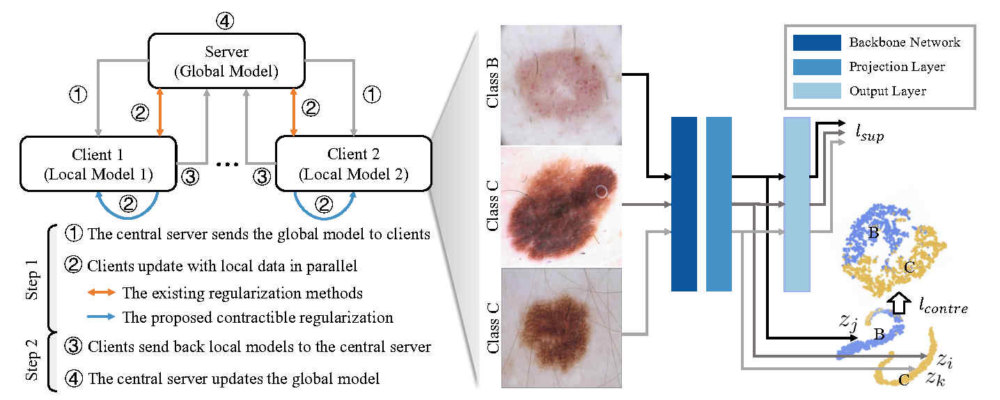

# Contractible Regularization for Federated Learning on Non-IID Data
This repository is an official pytorch implementation of "Contractible Regularization for Federated Learning on Non-IID Data", ICDM 2022.



## Abstract
In medical domain, the clinical data are scattered over different hospitals. Due to security and privacy concerns, gathering all data and training a global supervised model is very difficult. Several federated learning models have been proposed for training over isolated data in recent years. These models usually employ a client-server framework: 1) train local models on clients in parallel; 2) aggregate local models on the server to produce a global one. By iterating the above two steps, federated learning aims to approximate the performance of a model centrally trained on data. However, due to the non-IID data distribution issue, local models could deviate from the optimal model. Then, aggregating multiple deviated models could produce a biased global model. To address this problem, we propose a contractible regularization (ConTre) to act on the local model's latent space. On each client, we first project the input data into a latent space and then pose regularization to avoid converging too fast to a bad local optima. The proposed regularization can be easily integrated into existing federated learning frameworks without bringing in additional parameters. According to experimental results on multiple natural and medical image datasets, the proposed ConTre can significantly improve the performance of various federated learning frameworks. We provide the source code in the supplementary materials.

## Requirements
- Pytorch>=1.1.0
- CPU or GPU
- Other packages can be installed as the following instruction:
```
pip install requirements.txt
```

## Main results
| Method | ConTre (ours) | CIFAR-10 (C=2) | Tiny-ImageNet (C=20) | Dermnet (C=4) | ISIC-B (C=2) |
|:-:|:-:|:-:|:-:|:-:|:-:|
| SOLO  |  | 18.49±0.01 | 4.90±0.01 | 10.18±0.03 | 42.33±0.07 |
| FedAvg |  | 47.86±2.03 | 23.05±0.28 | 16.36±0.60 | 51.74±3.49 |
| FedAvg | ✓ | 53.34±1.50 | 24.34±0.50 | 17.73±0.68 | 54.29±4.69 |
| FedProx |  | 46.28±1.03 | 21.53±0.51 | 16.71±1.82 | 51.39±2.03 |
| FedProx | ✓ | 51.10±2.33 | 23.56±0.52 | 17.87±1.60 | 51.97±3.10 |
| FedNova |  | 47.04±1.19 | 22.67±0.44 | 15.40±1.19 | 50.26±7.34 |
| FedNova | ✓ | 51.75±1.81 | 24.03±0.50 | 16.40±1.71 | 55.33±2.55 |
| SCAFFOLD |  | 52.50±1.56 | 30.50±0.26 | 14.56±2.53 | 53.01±4.53 |
| SCAFFOLD | ✓ | 53.15±1.84 | 31.71±0.61 | 15.39±2.12 | 55.24±5.11 |
| MOON |  | 46.08±0.49 | 22.50±1.15 | 17.94±2.41 | 53.26±2.63 |
| MOON | ✓ | 48.54±1.59 | 23.09±0.87 | 18.14±2.79 | 57.47±1.18 |

Note: we run all experiments three times with different random seeds and then report the mean along with the standard derivation of the corresponding metric.

## Main running parameters
| Parameter | Function | Options |
| --- | --- | --- |
| trainer | Specify the federated learning algorithm | FedAvg, FedAvgOurs |
| model | Encoder model used in training | simple-cnn (for cifar10) and gnresnet18 (for others) |
| out_dim | the output dimension for the projection layer | default: 256 |
| dataset | dataset used for training | cifar10, tinyimagenet, isic, and dermnet |
| partition | the data partitioning strategy | iid, noniid-#label2, noniid-#label4, noniid-#label20, and so on (see "utils/utils.py" for more details) |
| n_parties | number of clients | (arbitrarily positive integer) |
| rounds | number of maximum communication rounds | default: 50 |
| batch-size | input batch size for training | default: 64 |
| lr | learning rate | default: 0.005 |
| weight_decay | L2 regularizaiton strength | default: 1e-5 |
| epochs | number of local epochs | default: 10 |
| output_dir | output directory path | default: ../output |

## Dataset preparation
All datasets can be downloaded and placed in the data directory (as shown below), where the information to build ISIC-B can be found in "isic2019_info.txt".
- CIFAR-10: http://www.cs.toronto.edu/~kriz/cifar.html
- Tiny-ImageNet: http://cs231n.stanford.edu/tiny-imagenet-200.zip
- ISIC: https://challenge.isic-archive.com/landing/2019/
- Dermnet: http://www.dermnet.com/

```
.(ICDM_ConTre.pytorch)
├── code/
├── data/
|   ├── cifar-10-batches-py/
|   ├── dermnet/
|   ├── isic2019/
|   └── tiny-imagenet-200/
└── output/
```

## Quick start
First switch to the "code" directory. Then, running the code as the following command for training along with testing. All results will be recorded in the corresponding log file. 

### CIFAR-10
```
# FedAvg
python main.py --trainer FedAvg \
            --dataset cifar10 \
            --datadir ../data/ \
            --partition noniid-#label2 \
            --n_parties 10 \
            --rounds 50 \
            --model simple-cnn \
            --init_seed 0

# FedAvg+ConTre
python main.py --trainer FedAvgOurs \
            --dataset cifar10 \
            --datadir ../data/ \
            --partition noniid-#label2 \
            --n_parties 10 \
            --rounds 50 \
            --model simple-cnn \
            --init_seed 0
```

### Tiny-ImageNet
```
# FedAvg
python main.py --trainer FedAvg \
            --dataset tinyimagenet \
            --datadir ../data/tiny-imagenet-200/ \
            --partition noniid-#label20 \
            --n_parties 20 \
            --rounds 50 \
            --model gnresnet18 \
            --init_seed 0

# FedAvg+ConTre
python main.py --trainer FedAvgOurs \
            --dataset tinyimagenet \
            --datadir ../data/tiny-imagenet-200/ \
            --partition noniid-#label20 \
            --n_parties 20 \
            --rounds 50 \
            --model gnresnet18 \
            --init_seed 0
```

### ISIC-B
```
# FedAvg
python main.py --trainer FedAvg \
            --dataset isic \
            --datadir ../data/isic2019/ \
            --partition noniid-#label2 \
            --n_parties 4 \
            --rounds 50 \
            --model gnresnet18 \
            --init_seed 0

# FedAvg+ConTre
python main.py --trainer FedAvgOurs \
            --dataset isic \
            --datadir ../data/isic2019/ \
            --partition noniid-#label2 \
            --n_parties 4 \
            --rounds 50 \
            --model gnresnet18 \
            --init_seed 0
```

### Dermnet
```
# FedAvg
python main.py --trainer FedAvg \
            --dataset dermnet \
            --datadir ../data/dermnet/ \
            --partition noniid-#label4 \
            --n_parties 10 \
            --rounds 50 \
            --model gnresnet18 \
            --init_seed 0

# FedAvg+ConTre
python main.py --trainer FedAvgOurs \
            --dataset dermnet \
            --datadir ../data/dermnet/ \
            --partition noniid-#label4 \
            --n_parties 10 \
            --rounds 50 \
            --model gnresnet18 \
            --init_seed 0
```